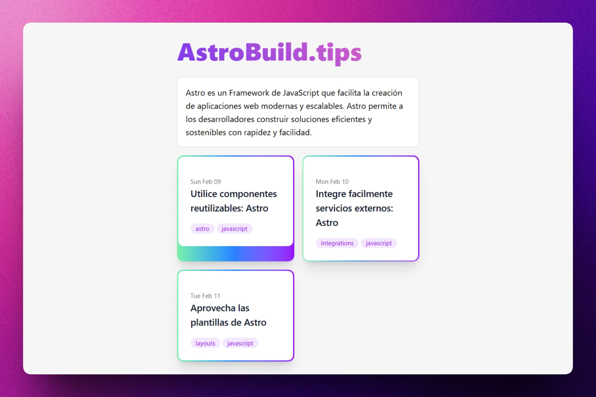
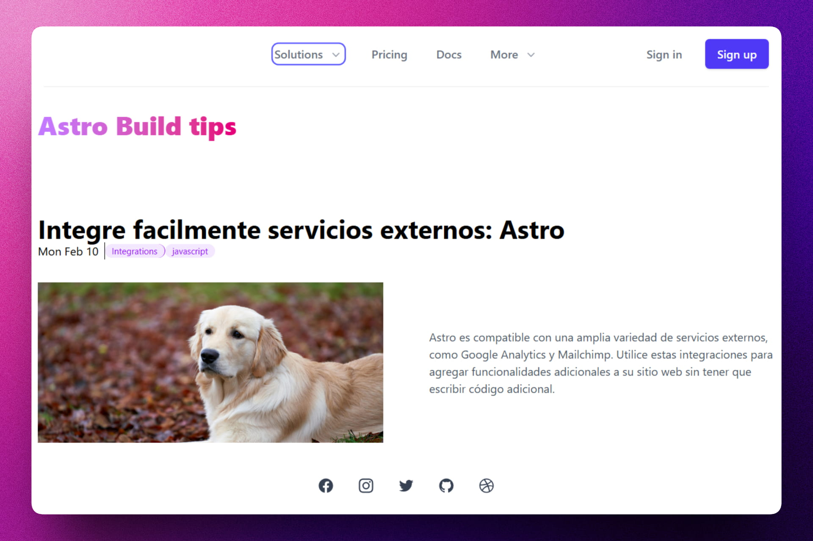
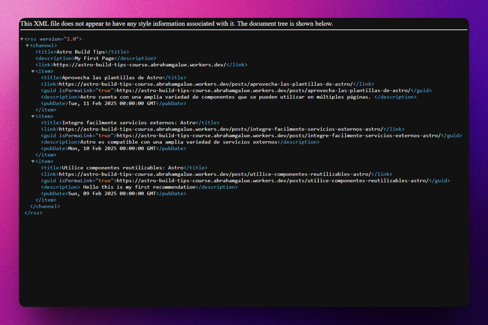

<div align='center'>

# 🚀 Astro: Build Tips Course

</div>

### Proyecto del curso de Astro: Build Tips.

> 🧩 Aquí puedes ver su [**Live Demo**](https://astro-build-tips-course.abrahamgalue.workers.dev/).







## 🚀 Descripción

Este proyecto es el resultado del curso **Astro: Build Tips**, enfocado en aprender técnicas avanzadas y mejores prácticas para construir sitios web rápidos y eficientes con Astro.

El proyecto incluye ejemplos del uso de múltiples frameworks de frontend como **React**, **Svelte** y **Vue** dentro de una misma aplicación Astro, además de integración con **MDX**, **Tailwind CSS** y despliegue en **Cloudflare Pages**.

## ⚡ Comenzar

### Prerrequisitos

1. Git.
2. Node.js 20 o superior.
3. pnpm (recomendado).

## 🔧 Instalación

### Usando pnpm

1. **Clona el repositorio:**

   ```bash
   git clone https://github.com/abrahamgalue/astro-build-tips-course.git
   cd astro-build-tips-course
   ```

2. **Instala las dependencias:**

   ```bash
   pnpm install
   ```

3. **Inicia el servidor de desarrollo:**

   ```bash
   pnpm dev
   ```

4. **Abre tu navegador y visita:**

   ```bash
   http://localhost:4321
   ```

## 🎭 Tecnologías

- [**Astro**](https://astro.build/) Framework para sitios web orientados al contenido.
- [**React**](https://react.dev/) Integración de componentes interactivos.
- [**Svelte**](https://svelte.dev/) Integración de componentes ligeros.
- [**Vue**](https://vuejs.org/) Integración de componentes dinámicos.
- [**Tailwind CSS**](https://tailwindcss.com/) Estilizado moderno y rápido.
- [**MDX**](https://mdxjs.com/) Uso de JSX en archivos Markdown.
- [**Cloudflare**](https://www.cloudflare.com/) Despliegue y hosting.
